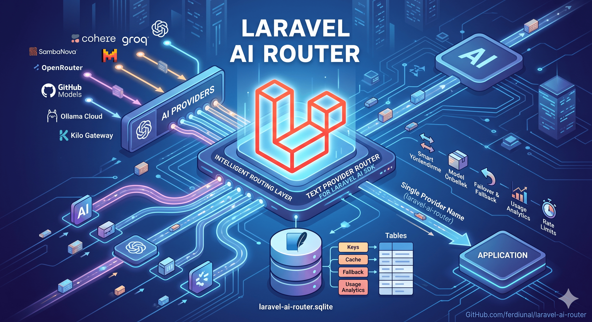

# Laravel AI Router

English | [Türkçe](README.TR.md)

Laravel AI Router is a Laravel AI SDK text provider that routes prompts through locally managed provider keys, available-model caches, fallback metadata, rate-limit windows, and usage analytics. It is designed for applications that want one Laravel AI provider name (`laravel-ai-router`) while using multiple OpenAI-compatible providers and multiple labeled API keys behind a local routing layer.

The package stores its own operational state in a dedicated package database connection by default. The default storage target is `database/laravel-ai-router.sqlite`, which keeps provider keys, model cache rows, fallback routing rows, rate-limit counters, usage records, runtime custom provider definitions, and package settings out of the host application's main tables.

## What this is / what this is not

Laravel AI Router is a Laravel AI SDK text-provider router. It is not a standalone OpenAI-compatible HTTP proxy and it does not expose `/v1/chat/completions` or `/v1/models` routes. Host applications call it through Laravel AI (`ai()->using('laravel-ai-router', 'auto')`), and the package routes those calls to configured provider keys.

Built-in routable providers in this release are limited to adapters that are implemented and covered by tests:

| Provider | Adapter |
| --- | --- |
| Cohere | OpenAI-compatible compatibility API |
| Groq | OpenAI-compatible |
| Cerebras | OpenAI-compatible |
| SambaNova | OpenAI-compatible |
| NVIDIA NIM | OpenAI-compatible, seeded disabled by default |
| Mistral | OpenAI-compatible |
| OpenRouter | OpenAI-compatible |
| GitHub Models | OpenAI-compatible |
| Zhipu AI | OpenAI-compatible |
| Ollama Cloud | OpenAI-compatible |
| Kilo Gateway | OpenAI-compatible, anonymous placeholder key supported |
| Pollinations | OpenAI-compatible, anonymous placeholder key supported |
| LLM7 | OpenAI-compatible, anonymous placeholder key supported |

Google Gemini and Cloudflare Workers AI native adapters are intentionally not advertised as built-in routable providers until provider-specific adapters are implemented.

Free-tier and anonymous providers can change limits, model availability, authentication behavior, or terms of service without notice. Treat free-tier routing as development/prototype infrastructure unless you have reviewed each upstream provider's terms, quota, and SLA posture for your production use case.

## Features

- Laravel AI driver name: `laravel-ai-router`.
- Global `ai()` helper with `using(...)->prompt(...)->asText()` convenience flow for Tinker and small call sites.
- Default text model: `auto`.
- Provider API key management: add, list, enable, disable, remove.
- Runtime custom OpenAI-compatible provider definitions: add, list, enable, disable, remove.
- Encrypted API-key storage through Laravel encryption.
- Masked CLI output; raw provider keys are not printed.
- Provider + label scoped available-model cache with free/credits metadata.
- `LaravelAiRouterProvider::models()` access to cached model IDs.
- Non-streaming text generation through Laravel AI `TextProvider`.
- Streaming text generation through Laravel AI stream events.
- Structured output support through Laravel AI structured response types.
- Non-stream OpenAI-compatible function tool-call loop.
- Internal bounded retry/failover across eligible provider keys plus Laravel AI failover exception mapping for retryable provider errors.
- Local request/usage analytics by provider, label, model, status, token counts, latency, and error category.
- Bounded SQLite optimization with WAL, foreign keys, busy timeout, synchronous mode, temp store, and cache-size controls.
- Interactive Artisan commands implemented with Laravel Prompts.

## Requirements

- PHP `^8.4`
- Laravel components `^13.0`
- `laravel/ai ^0.7`
- `laravel/prompts ^0.3.6`

The package is a Laravel package and is auto-discovered through the service provider declared in `composer.json`.

## Installation

```bash
composer require ferdiunal/laravel-ai-router
php artisan laravel-ai-router:install
```

The install command performs the package setup in this order:

1. Creates the configured SQLite file when the package connection targets SQLite storage.
2. Runs the package-owned internal migrations against the configured package connection.
3. Seeds the curated model catalog and fallback ordering rows.
4. Applies safe SQLite PRAGMA optimizations when enabled and applicable.
5. Starts the provider-key setup wizard in an interactive console.

By default, no migration file has to be published into the host application's `database/migrations` directory. The package migrations are internal package migrations and are executed by `laravel-ai-router:install` against the package connection.

## Configuration

Publish the package config only when you need to override defaults:

```bash
php artisan vendor:publish --tag=laravel-ai-router-config
```

Register the provider in `config/ai.php`:

```php
'providers' => [
    'laravel-ai-router' => [
        'driver' => 'laravel-ai-router',
    ],
],

'default' => 'laravel-ai-router',
```

The package config keeps `auto` as the default text model:

```php
// config/laravel-ai-router.php
return [
    'driver' => env('LARAVEL_AI_ROUTER_DRIVER', 'laravel-ai-router'),

    'models' => [
        'text' => [
            'default' => env('LARAVEL_AI_ROUTER_DEFAULT_MODEL', 'auto'),
        ],
        'cache_ttl_minutes' => env('LARAVEL_AI_ROUTER_MODELS_CACHE_TTL', 1440),
    ],

    'routing' => [
        // priority keeps the fallback order deterministic. balanced_random shuffles only
        // the top fallback rows by effective priority; normal key, cache, and limit checks
        // still decide whether a shuffled candidate is usable.
        'auto_strategy' => env('LARAVEL_AI_ROUTER_AUTO_STRATEGY', 'priority'),
        'random_pool_size' => env('LARAVEL_AI_ROUTER_RANDOM_POOL_SIZE', 5),
        'random_priority_window' => env('LARAVEL_AI_ROUTER_RANDOM_PRIORITY_WINDOW', 3),
    ],
];
```

### Package database connection

The default package connection name is `laravel-ai-router`. When this connection name is used, the service provider registers a dedicated SQLite connection backed by `database/laravel-ai-router.sqlite` unless you override the SQLite path.

```env
# Dedicated package SQLite path. This is used by the default laravel-ai-router connection.
LARAVEL_AI_ROUTER_SQLITE_DATABASE=/absolute/path/laravel-ai-router.sqlite

# Optional: point package storage to an existing host application connection.
# Use a connection name already defined in config/database.php, such as mysql, pgsql, or sqlite.
LARAVEL_AI_ROUTER_DB_CONNECTION=mysql
```

Use `LARAVEL_AI_ROUTER_DB_CONNECTION` only when you intentionally want package-owned state to live on an existing host connection. The value `laravel-ai-router` means the package's default dedicated SQLite connection.

## Provider Key Management

Provider keys are identified by `provider + label`. This allows multiple keys for the same provider, for example `openrouter / Primary`, `openrouter / Backup`, or `groq / Team`.

```bash
php artisan laravel-ai-router:provider:add
php artisan laravel-ai-router:provider:list
php artisan laravel-ai-router:provider:models
php artisan laravel-ai-router:provider:enable
php artisan laravel-ai-router:provider:disable
php artisan laravel-ai-router:provider:remove
```

`laravel-ai-router:provider:add` uses Laravel Prompts to collect:

1. Provider platform.
2. API key.
3. Provider-key label.
4. Optional model-cache refresh.
5. Optional default model selection from cached available models.

The raw API key is encrypted before persistence and is never rendered in command output. Lists and prompts show masked credentials only.

## Runtime Custom OpenAI-compatible Providers

Runtime custom providers let you add OpenAI-compatible gateways, proxies, or providers without changing package code.

```bash
php artisan laravel-ai-router:provider-definition:add
php artisan laravel-ai-router:provider-definition:list
php artisan laravel-ai-router:provider-definition:enable
php artisan laravel-ai-router:provider-definition:disable
php artisan laravel-ai-router:provider-definition:remove

php artisan laravel-ai-router:provider:add
php artisan laravel-ai-router:provider:models
```

A runtime provider definition contains:

- Provider slug, for example `my-openai-proxy`.
- Display name.
- OpenAI-compatible base URL, for example `https://api.example.com/v1`.
- Optional metadata headers as JSON, for example `{"X-Title":"Laravel AI Router"}`.
- Timeout in milliseconds.
- Optional anonymous placeholder-key support.

Security constraints are enforced before persistence and before request dispatch:

- Base URLs must use public `https://` URLs.
- Credentials, query strings, fragments, localhost, local/test/internal hostnames, private IPs, and reserved IPs are rejected.
- DNS resolution must return public addresses only.
- Redirects are not followed for runtime provider validation.
- Authentication-bearing headers are rejected, including `Authorization`, `Proxy-Authorization`, `X-Api-Key`, and token/secret/password-like header names.
- Extra headers are for metadata/proxy headers only; provider credentials must be stored through provider keys.

You can also define static custom providers in config:

```php
// config/laravel-ai-router.php
'providers' => [
    'custom' => [
        'my-openai-proxy' => [
            'name' => 'My OpenAI Proxy',
            'base_url' => 'https://api.example.com/v1',
            'headers' => [
                'X-Title' => 'Laravel AI Router',
            ],
            'timeout_ms' => 30000,
            'requires_placeholder_key' => false,
        ],
    ],
],
```

When a routable OpenAI-compatible provider returns model IDs from its `/models` endpoint, Laravel AI Router can cache those model IDs by provider + label and create runtime model/fallback rows so they can participate in exact model routing.

## Model Cache and Default Model Preference

Provider model caches are scoped by provider key. A cache row stores the provider platform, provider label, model ID, display name, context window, rate limits, token limits, free-tier marker, tool support marker, source, and refresh timestamp.

Refresh and inspect the cache with:

```bash
php artisan laravel-ai-router:provider:models
```

The command can refresh the selected key's cache, list cached available models, and select a default model through a searchable prompt. Model listing and default selection expose only rows that match all of these constraints:

- The provider platform has a routable adapter.
- The provider key is enabled.
- The provider key status is not `invalid`.
- The provider key model cache has not expired.
- The cache row matches the provider key ID, platform, and label.
- The cache row is enabled.

Live model discovery is provider-agnostic for routable OpenAI-compatible providers: valid `/models` rows are cached even when their IDs do not end in `:free`. Free-tier status is stored as metadata (`is_free`); NVIDIA NIM live rows are marked as free credit-backed models (`free` + `credits-based`), while other non-free live rows default to the `credits-based` budget label. Exact live model IDs are routeable directly, and newly discovered built-in live rows keep their auto-fallback row disabled by default so `auto` does not unexpectedly spend credits.

The package config default remains `auto`. When the user selects a default model through the CLI, the selection is persisted in the package settings table and read at runtime by `LaravelAiRouterProvider::defaultTextModel()`. This does not mutate config files.

Programmatic model access:

```php
use Ferdiunal\LaravelAiRouter\LaravelAiRouterProvider;
use Laravel\Ai\AiManager;

$provider = app(AiManager::class)->textProvider('laravel-ai-router');

assert($provider instanceof LaravelAiRouterProvider);

$modelIds = $provider->models('openrouter', 'Primary');
// ['auto', 'paid/model', 'qwen/qwen3-coder:free', ...]
```

## Prompt Usage

Before sending prompts, run the install/setup flow and add at least one enabled provider key:

```bash
php artisan laravel-ai-router:install
php artisan laravel-ai-router:provider:add
```

Laravel AI Router can be called in two ways:

1. The package convenience helper: `ai()->using(...)->prompt(...)->asText()`.
2. Native Laravel AI agents: classes that implement `Laravel\Ai\Contracts\Agent` and use `Laravel\Ai\Promptable`.

### Quick Tinker usage with the `ai()` helper

The package ships a global `ai()` helper for Tinker and small application call sites. It returns Laravel AI Router's convenience helper, not Laravel AI SDK's facade.

```bash
php artisan tinker
```

```php
ai()
    ->using('laravel-ai-router', 'auto')
    ->instructions('Answer concisely and include operationally relevant details.')
    ->prompt('Summarize this ticket in three bullet points.')
    ->asText();
```

`auto` lets Laravel AI Router choose an eligible provider key and fallback-enabled cached model. By default the auto chain remains priority-based (`routing.auto_strategy=priority`). Set `LARAVEL_AI_ROUTER_AUTO_STRATEGY=balanced_random` to shuffle only the configured top fallback pool (`LARAVEL_AI_ROUTER_RANDOM_POOL_SIZE`, bounded by `LARAVEL_AI_ROUTER_RANDOM_PRIORITY_WINDOW`) while still enforcing disabled/invalid-key skips, model-cache compatibility, cooldowns, and rate/token-limit checks. Exact model calls still route only that requested model ID by default.

You can also route an exact cached model ID:

```php
ai()
    ->using('laravel-ai-router', 'qwen/qwen3-coder:free')
    ->prompt('Write a short release note.')
    ->asText();
```

When you need the full Laravel AI response instead of only text, call `response()`:

```php
$response = ai()
    ->using('laravel-ai-router', 'auto')
    ->timeout(20)
    ->prompt('Summarize the order status.')
    ->response();

(string) $response;              // response text
$response->usage->promptTokens;  // input token count
$response->usage->completionTokens;
$response->meta->provider;       // "laravel-ai-router"
$response->meta->model;          // routed upstream model ID
```

The helper also exposes the underlying Laravel AI manager when you need low-level SDK access:

```php
use Ferdiunal\LaravelAiRouter\LaravelAiRouterProvider;

$provider = ai()->manager()->textProvider('laravel-ai-router');

assert($provider instanceof LaravelAiRouterProvider);

$models = $provider->models('openrouter', 'Primary');
// ['auto', 'paid/model', 'qwen/qwen3-coder:free', ...]
```

Unknown method calls on `ai()` are proxied to the underlying `Laravel\Ai\AiManager`, so `ai()->textProvider('laravel-ai-router')` also works.

### Native Laravel AI agent usage

For production code, a named agent class is usually easier to test and reuse:

```php
use Laravel\Ai\Attributes\Model;
use Laravel\Ai\Attributes\Provider;
use Laravel\Ai\Contracts\Agent;
use Laravel\Ai\Promptable;

#[Provider('laravel-ai-router')]
#[Model('auto')]
final class SupportAgent implements Agent
{
    use Promptable;

    public function instructions(): string
    {
        return 'Answer concisely and include operationally relevant details.';
    }
}
```

```php
$response = SupportAgent::make()->prompt('Summarize the order status.');

echo (string) $response;
```

You can still override provider/model per call:

```php
$response = SupportAgent::make()->prompt(
    'Summarize the order status.',
    provider: 'laravel-ai-router',
    model: 'qwen/qwen3-coder:free',
    timeout: 20,
);
```

Failover usage through Laravel AI provider arrays:

```php
$response = SupportAgent::make()->prompt(
    'Summarize the order status.',
    provider: [
        'laravel-ai-router' => 'auto',
        'openai' => 'gpt-4o-mini',
    ],
    timeout: 20,
);
```

Retryable rate-limit, temporary overload, timeout, and insufficient-credit conditions are mapped to Laravel AI failover-compatible exception types where applicable.

## Function Tools

Laravel AI Router supports non-streaming OpenAI-compatible tool calls. Tools are regular Laravel AI `Tool` classes; the router maps their schema to OpenAI-compatible `tools`, executes requested calls locally, and sends tool result messages back to the selected provider.

> Streaming tool calls are intentionally not supported yet. Use `prompt()` / `asText()` / `response()` for tool workflows. Calling `stream()` with tools fails before opening the upstream stream.

### Define a tool

```php
use Illuminate\Contracts\JsonSchema\JsonSchema;
use Illuminate\JsonSchema\Types\Type;
use Laravel\Ai\Contracts\Tool;
use Laravel\Ai\Tools\Request;

final class LookupOrder implements Tool
{
    public function name(): string
    {
        return 'lookup_order';
    }

    public function description(): string
    {
        return 'Look up an order total by order ID.';
    }

    public function handle(Request $request): string
    {
        $orderId = $request['order_id'];

        // Replace this with your application lookup.
        return "Order {$orderId} total is 42 TRY";
    }

    /** @return array<string, Type> */
    public function schema(JsonSchema $schema): array
    {
        return [
            'order_id' => $schema->string()->required(),
        ];
    }
}
```

`name()` is optional in the `Tool` contract, but recommended. If it is missing, Laravel AI derives the tool name from the class basename.

### Use tools with the `ai()` helper

```php
$response = ai()
    ->using('laravel-ai-router', 'auto')
    ->instructions('Use tools when needed to answer order-related questions.')
    ->withTools([new LookupOrder])
    ->prompt('What is the total for order A-100?')
    ->response();

echo (string) $response;
// "The total for order A-100 is 42 TRY."

$response->toolCalls;   // Collection of ToolCall objects
$response->toolResults; // Collection of ToolResult objects
$response->steps;       // Collection of Step objects, including tool loop iterations
```

### Use tools with a named agent

```php
use Laravel\Ai\Attributes\Model;
use Laravel\Ai\Attributes\Provider;
use Laravel\Ai\Contracts\Agent;
use Laravel\Ai\Contracts\HasTools;
use Laravel\Ai\Contracts\Tool;
use Laravel\Ai\Promptable;

#[Provider('laravel-ai-router')]
#[Model('auto')]
final class OrderAgent implements Agent, HasTools
{
    use Promptable;

    public function instructions(): string
    {
        return 'Use tools when needed to answer order-related questions.';
    }

    /** @return iterable<int, Tool> */
    public function tools(): iterable
    {
        return [new LookupOrder];
    }
}
```

```php
$response = OrderAgent::make()->prompt('What is the total for order A-100?');

echo (string) $response;
```

## Streaming Usage

Laravel AI Router supports text streaming through Laravel AI stream events:

```php
use Laravel\Ai\Streaming\Events\TextDelta;

$stream = ai()
    ->using('laravel-ai-router', 'auto')
    ->instructions('Answer with a short streaming response.')
    ->prompt('Explain the current order status.')
    ->stream();

foreach ($stream as $event) {
    if ($event instanceof TextDelta) {
        echo $event->delta;
    }
}
```

The same behavior is available through named agents:

```php
$stream = SupportAgent::make()->stream(
    'Explain the current order status.',
    provider: 'laravel-ai-router',
    model: 'auto',
);
```

## Structured Output Usage

Laravel AI Router supports Laravel AI structured output for non-streaming text requests. The package sends JSON-mode style options upstream and maps valid JSON content back into Laravel AI structured response objects.

```php
use Illuminate\Contracts\JsonSchema\JsonSchema;
use Illuminate\JsonSchema\Types\Type;
use Laravel\Ai\Attributes\Model;
use Laravel\Ai\Attributes\Provider;
use Laravel\Ai\Contracts\Agent;
use Laravel\Ai\Contracts\HasStructuredOutput;
use Laravel\Ai\Promptable;

#[Provider('laravel-ai-router')]
#[Model('auto')]
final class TicketAnalyzer implements Agent, HasStructuredOutput
{
    use Promptable;

    public function instructions(): string
    {
        return 'Return a JSON response with the requested ticket analysis.';
    }

    /** @return array<string, Type> */
    public function schema(JsonSchema $schema): array
    {
        return [
            'summary' => $schema->string()->required(),
            'priority' => $schema->integer()->required(),
        ];
    }
}
```

```php
$response = TicketAnalyzer::make()->prompt(
    'Analyze this ticket.',
    provider: 'laravel-ai-router',
    model: 'auto',
);

$response['summary'];  // "..."
$response['priority']; // 3
$response->usage;
$response->meta;
```

## Laravel AI SDK Capability Matrix

| Capability | Status | Notes |
| --- | --- | --- |
| Text generation | Supported | Returns Laravel AI `TextResponse` or `StructuredTextResponse`, including usage and metadata. |
| Text streaming | Supported | Converts OpenAI-compatible SSE chunks into Laravel AI `StreamStart`, `TextStart`, `TextDelta`, `TextEnd`, and `StreamEnd` events. |
| Structured output | Supported | Sends JSON-mode style options and maps valid JSON content into Laravel AI structured response types. |
| Function tools | Supported for non-streaming | Executes OpenAI-compatible `tools` / `tool_calls` loops and sends tool result messages back to the provider. |
| Streaming tools | Not supported | Fails before opening the upstream stream with a clear `LogicException`. |
| Failover | Supported | Retries eligible internal provider keys up to `routing.max_attempts`, then maps rate limits, insufficient credit/quota, timeout, and overload errors to Laravel AI failover exception types. `auto` defaults to priority ordering and can opt into `balanced_random` top-pool shuffling without broadening the eligible model set. |
| Images, audio, transcription, embeddings, reranking, files, stores | Not supported | The package advertises only the text provider contract and throws explicit capability errors for unsupported methods. |

## Usage Analytics

Display usage analytics with:

```bash
php artisan laravel-ai-router:usage
```

Tracked fields include:

- Provider platform.
- Provider label.
- Model ID.
- Success or error status.
- Input tokens.
- Output tokens.
- Total tokens.
- Latency in milliseconds.
- Error type.
- Error category.
- Redacted error message.
- Request timestamps.

Usage rows are stored in package-owned storage and can be used to inspect provider reliability, model distribution, latency, token volume, and error trends.

### Retention and pruning

Laravel AI Router keeps usage rows for `LARAVEL_AI_ROUTER_USAGE_RETENTION_DAYS` days by default and rate-window/cooldown rows for `LARAVEL_AI_ROUTER_RATE_WINDOW_RETENTION_DAYS` days by default. Prune old package storage rows with:

```bash
php artisan laravel-ai-router:prune
```

Use `--vacuum` only when you explicitly want SQLite to compact the package database after pruning:

```bash
php artisan laravel-ai-router:prune --vacuum
```

## SQLite Optimization and Package Storage

When the package connection uses SQLite and optimization is enabled, the package applies bounded PRAGMA settings:

- `journal_mode = WAL`, except for in-memory databases.
- `foreign_keys = ON`.
- `busy_timeout` from config, clamped to safe bounds.
- `synchronous` from an allowed enum-like set.
- `temp_store = MEMORY` when enabled.
- `cache_size` from config, clamped to safe bounds.

Relevant config shape:

```php
'database' => [
    'connection' => env('LARAVEL_AI_ROUTER_DB_CONNECTION', 'laravel-ai-router'),
    'sqlite' => [
        'database' => env('LARAVEL_AI_ROUTER_SQLITE_DATABASE', database_path('laravel-ai-router.sqlite')),
        'optimize' => env('LARAVEL_AI_ROUTER_SQLITE_OPTIMIZE', true),
        'journal_mode' => env('LARAVEL_AI_ROUTER_SQLITE_JOURNAL_MODE', 'WAL'),
        'synchronous' => env('LARAVEL_AI_ROUTER_SQLITE_SYNCHRONOUS', 'NORMAL'),
        'busy_timeout_ms' => env('LARAVEL_AI_ROUTER_SQLITE_BUSY_TIMEOUT_MS', 5000),
        'cache_size_kb' => env('LARAVEL_AI_ROUTER_SQLITE_CACHE_SIZE_KB', 20000),
    ],
],
```

Internal migrations are idempotent enough to tolerate existing package tables on the package connection. They do not need to be published into host application migrations.

## Security Model

- Provider API keys are encrypted with Laravel `Crypt` before persistence.
- CLI output uses masked credentials only.
- Runtime custom provider URLs must be public HTTPS endpoints.
- Runtime custom provider header names cannot carry authentication headers or token/secret/password-like names.
- Provider model cache refresh marks keys invalid on authentication failures and avoids curated fallback for auth failures.
- Usage logging redacts bearer tokens from exception messages before persistence.
- Streaming parsers enforce line and aggregate event byte limits.
- SQLite PRAGMA config values are clamped before execution.

## Upgrade Notes

Earlier versions exposed publishable migration stubs for host application migrations. The current install flow keeps package-owned migrations internal and executes them through `laravel-ai-router:install` against the package connection.

If you previously published package migration stubs into the host application's `database/migrations` directory and stored Laravel AI Router data in host tables, the new install command will not automatically move that data into the dedicated package database. To preserve existing provider keys, usage rows, model cache rows, or settings:

1. Back up the host database.
2. Install or update the package.
3. Run `php artisan laravel-ai-router:install` to prepare the package storage.
4. Write and run a one-off migration or command that copies the old host rows into the package connection tables.
5. Verify provider-key encryption, model cache freshness, and usage analytics after the migration.

## Development and Validation

```bash
composer format:check
composer analyse
composer test
composer ci
```

`composer ci` runs formatting checks, PHPStan analysis, and the full Pest test suite.

## Troubleshooting

### The package SQLite database file is missing

Run:

```bash
php artisan laravel-ai-router:install
```

If you use a custom path, verify `LARAVEL_AI_ROUTER_SQLITE_DATABASE` points to a writable location and that the parent directory can be created by the application user.

### A provider key is marked invalid

Authentication failures during model refresh or routed requests mark the selected key invalid. Add a new key or re-enable/update the key after verifying the credential with the provider.

### Cached models are not shown

`laravel-ai-router:provider:models` exposes only routable, enabled, non-invalid, non-expired cache rows for the selected provider key. Refresh the selected key's cache and verify the provider adapter is implemented.

### Streaming tools fail before the provider stream opens

Streaming tool calls are intentionally unsupported. Use non-streaming text generation when tools are required.

### A custom provider base URL is rejected

Ensure the URL uses public HTTPS, has no credentials/query/fragment, does not point to localhost or private/reserved networks, and resolves only to public IP addresses.
